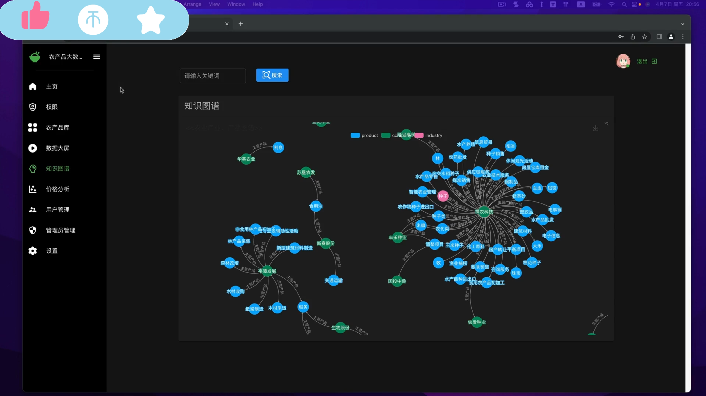
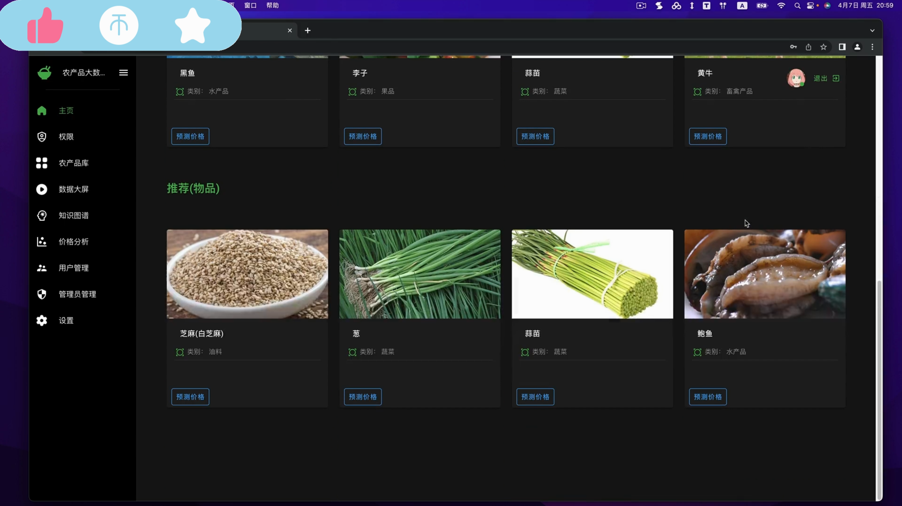
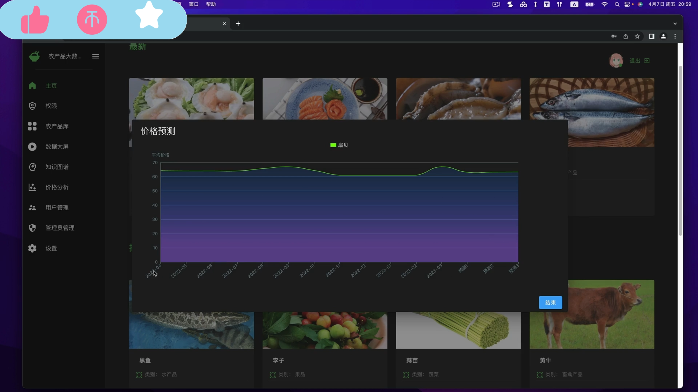
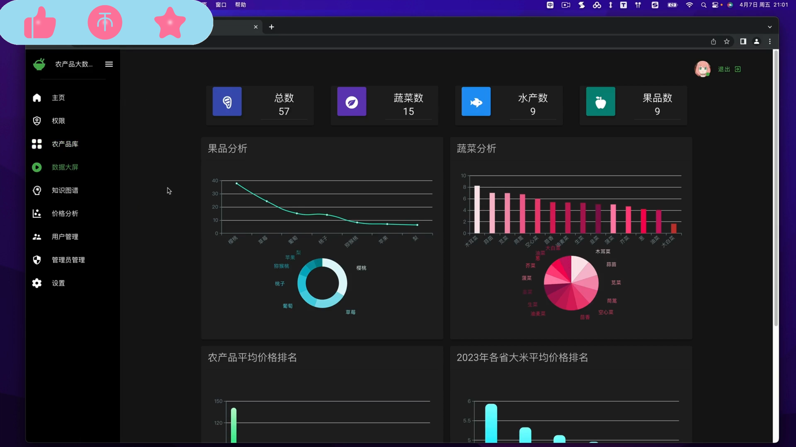
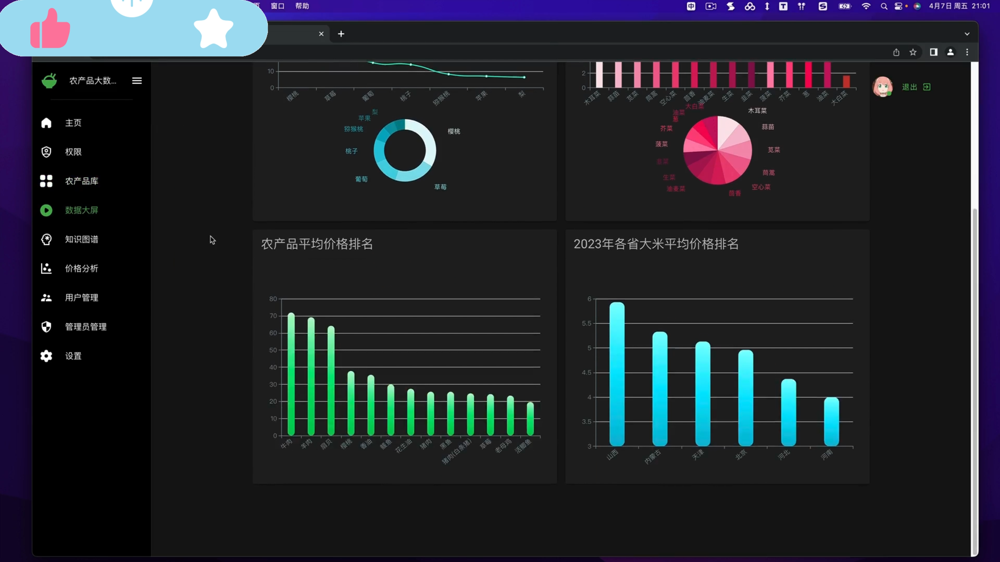
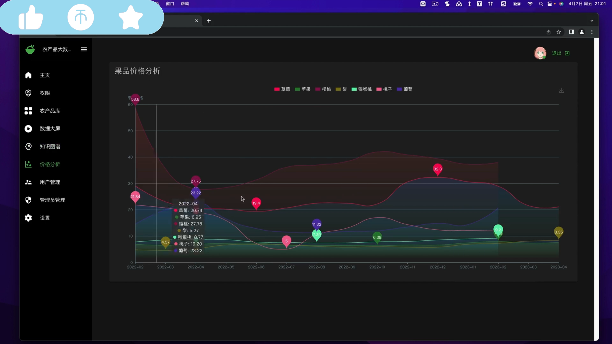

## 计算机毕业设计碾压导师Django+neo4j知识图谱农产品推荐系统 农产品价格预测 农产品爬虫 农产品商城 农产品大数据 农产品数据分析可视化 PySpark Hadoop

## 要求
### 源码有偿！一套(论文 PPT 源码+sql脚本+教程)

### 
### 加好友前帮忙start一下，并备注github有偿纯python农产品2025
### 我的QQ号是2827724252或者798059319或者 1679232425或者微信:bysj2023nb 或bysj1688

# 

### 加qq好友说明（被部分 网友整得心力交瘁）：
    1.加好友务必按照格式备注
    2.避免浪费各自的时间！
    3.当“客服”不容易，repo 主是体面人，不爆粗，性格好，文明人。
	
### 功能	
采集了60多种蔬菜、水果、水产、粮食等农产品的当前最新价格、历史价格
vue + django+neo4j+mysql 前后端分离架构搭建的系统
sklearn回归算法预测农产品价格、根据农产品的历史价格来预测的
两种协同过滤推荐算法来推荐农产品 、农产品的检索
可视化： 可视化大屏、果品价格分析
用户管理、管理员管理、权限、登录、注册、修改信息、短信验证码修改密码
在原版基础上增加了农业产业链知识图谱
neo4j 知识图谱可视化；
农产品配置的对应的图片；

### 演示视频
https://www.bilibili.com/video/BV1kE421w7uT/?spm_id_from=333.999.0.0

### 运行截图

